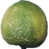
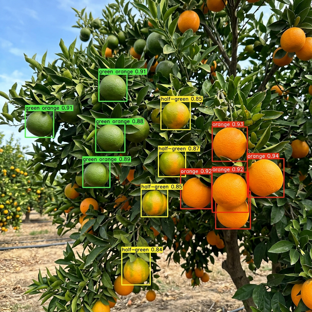

# 基于 YOLOv8 的柑橘成熟度检测

传统果园采摘主要靠人工肉眼判断柑橘生熟程度，效率低、主观性强，尤其在大规模果园场景下难以保证采摘质量的一致性。本项目用 YOLOv8 训练了一个柑橘成熟度检测模型，通过摄像头或图片自动识别柑橘的三种成熟状态，为智能采摘和分拣提供视觉判断依据。

## 痛点与目的

- **问题**：柑橘采摘季节，工人需要逐个判断果实成熟度，劳动强度大且容易出错，未成熟的果实被误摘直接导致经济损失
- **方案**：训练 YOLOv8 目标检测模型，对柑橘自动分为三个等级——青果（green orange）、半熟（half-green orange）、成熟（orange），辅助决策哪些该摘、哪些该留
- **应用**：配合机械臂或分拣流水线，可实现自动化采摘/分级

## 检测类别

| 类别 | 说明 |
|------|------|
| green orange | 未成熟（青绿色） |
| half-green orange | 半成熟（黄绿过渡） |
| orange | 完全成熟（橙黄色） |

## 使用方法

### 环境准备

```bash
pip install ultralytics
```

### 训练模型

```bash
python train.py
```

默认使用 YOLOv8n（nano 轻量版），训练 1000 个 epoch，batch size 40，输入尺寸 640×640。可根据实际 GPU 显存调整参数。

### 实时检测

```bash
python test1.py
```

调用摄像头进行实时柑橘成熟度检测。

## 数据集

数据集按 YOLO 标准格式组织，来源于 Roboflow，已划分为训练集/验证集/测试集：

```
Original dataset/
├── train/
│   ├── images/    # 训练图片
│   └── labels/    # YOLO 格式标注
├── valid/
│   ├── images/
│   └── labels/
└── test/
    ├── images/
    └── labels/
```

## 训练结果

### 数据集样本



### 检测效果



训练过程中生成的混淆矩阵、损失曲线等保存在 `runs/detect/` 目录下。

## 项目结构

```
.
├── train.py              # 训练脚本
├── test1.py              # 摄像头实时检测
├── yolov8n.pt            # YOLOv8 预训练权重
├── Original dataset/     # 数据集（需自行准备）
└── runs/                 # 训练输出
```

## 技术栈

- YOLOv8 (ultralytics)
- PyTorch
- OpenCV
- Python 3.x

## License

MIT License
